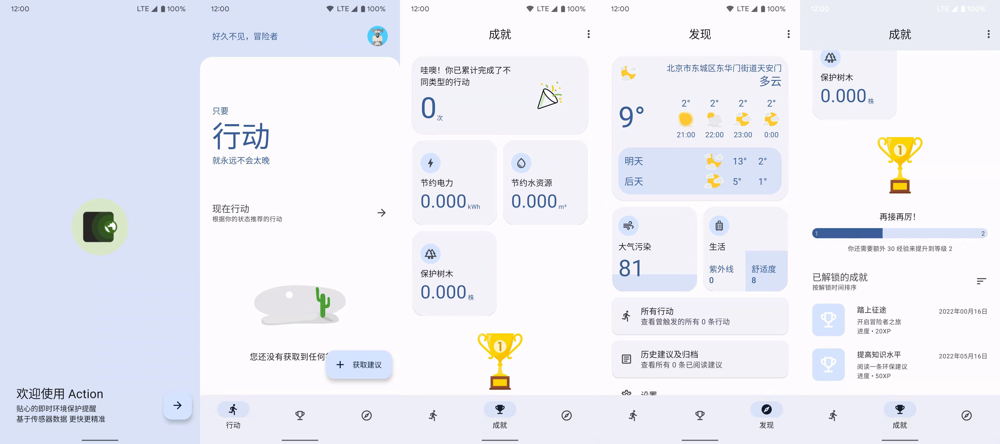

# Action

 **Action** is an app that reminds users to focus on eco-friendly behaviors in their daily lives. **Action** calls a lot of device sensors (light sensor/acceleration sensor/gravity sensor, etc.), and integrates Google Awareness Api and Transition Api to help applications sense user behavior (such as picking up the phone, walking, running, etc.) and changes in the surrounding environment ( brightness/location, etc.), and give corresponding environmental protection suggestions.

Technically, JetPack is heavily used, and the interface follows the Material You design specification.

The database is stored in LeanCloud.

## Table of Contents

- [Feature](#Feature)
- [Screenshot](#Screenshot)
- [Get help](#Get-help)
- [Contributing](#contributing)
- [License](#license)

## Feature

- Network synchronization database
- Sensor-based device status detection
- Intimate environmental protection notice
- Inspiring growth system with achievement collection
- Weather forecast and air quality report
- Beautiful Material-3-based interface

## Screenshot

## Get help

Try to submit GitHub issues to explain your questions and find solutions: [Issues](https://github.com/ojhdt/Action/issues)

You can contact the developers by the following ways:

📧 E-mail mailto:ojhdtmail@gmail.com

💬 Telegram https://telegram.me/ojhdt

## Contributing

PRs accepted.

## License

[MIT](LICENSE)